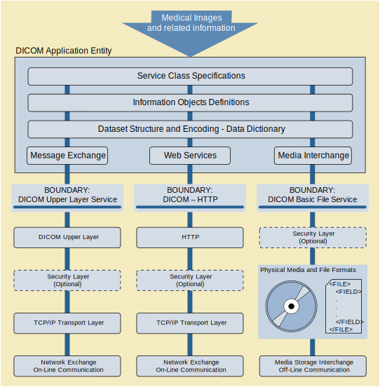
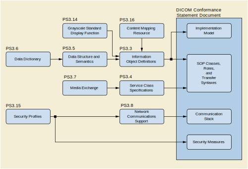
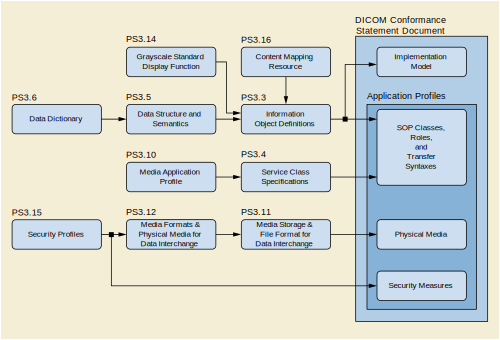

<h1 align="center">PS3.1 总览</h1>

## 目录

* [声明](#notice-and-disclaimer)
* [前言](#foreword)
* [1. 适用范围和作用领域](#scope-and-field-of-application)
    * [1.1. DICOM适用范围](#scope-of-dicom)
    * [1.2. 作用领域](#field-of-application)
    * [1.3. 历史](#history)
    * [1.4. 原则](#principles)
        * [1.4.1. 国际化和本地化](#global-applicability-and-localization)
        * [1.4.2. 持续维护](#continuous-maintenance)
        * [1.4.3. 信息对象和唯一对象识别](#information-objects-and-unique-object-identification)
        * [1.4.4. 一致性](#conformance)
        * [1.4.5. 信息模型的一致性](#consistency-of-information-model)
* [2. 其他标准的参考文献](#normative-references)
* [3. 名词释义](#definitions)
* [4. 符号和缩写](#symbols-and-abbreviations)
* [5. DICOM通信模型](#the-dicom-communication-model)
* [6. DICOM标准概述](#overview-of-the-content-of-the-dicom-standard)
    * [6.1. 文档结构](#document-structure)
    * [6.2. PS3.2: 一致性](#ps3-2-conformance)
    * [6.3. PS3.3: 信息对象定义](#ps3-3-information-object-definitions)
    * [6.4. PS3.4: 服务类标准](#ps3-4-service-class-specifications)
    * [6.5. PS3.5: 数据结构和编码](#ps3-5-data-structure-and-semantics)
    * [6.6. PS3.6: 数据字典](#ps3-6-data-dictionary)
    * [6.7. PS3.7: 消息交换](#ps3-7-message-exchange)
    * [6.8. PS3.8: 消息交换的网络通信支持](#ps3-8-network-communication-support-for-message-exchange)
    * [6.9. PS3.9: 不再使用(消息交换的点对点通信支持)](#ps3-9-point-to-point-communication-support-for-message-exchange)
    * [6.10. PS3.10: 用于媒体交换的媒体存储和文件格式](#ps3-10-media-storage-and-file-format-for-media-interchange)
    * [6.11. PS3.11: 媒体存储的应用配置](#ps3-11-media-storage-application-profiles)
    * [6.12. PS3.12: 媒体交换的格式和物理媒介](#ps3-12-storage-functions-and-media-formats-for-data-interchange)
    * [6.13. PS3.13: 不再使用(点对点通信的打印管理服务支持)](#ps3-13-print-management-point-to-point-communication-support)
    * [6.14. PS3.14: 灰度标准显示功能](#ps-3-14-grayscale-standard-display-function)
    * [6.15. PS3.15: 安全性和系统管理配置](#ps3-15-security-and-system-management-profiles)
    * [6.16. PS3.16: 内容映射资源](#ps3-16-content-mapping-resource)
    * [6.17. PS3.17: 解释性信息](#ps3-17-explanatory-information)
    * [6.18. PS3.18: Web服务](#ps3-18-web-services)
    * [6.19. PS3.19: 应用托管](#ps3-19-application-hosting)
    * [6.20. PS3.20: 使用HL7临床文档结构的影像报告](#ps3-20-imaging-reports-using-hl7-clinical-document-architecture)
    * [6.21. PS3.21: DICOM标准和其他表达方式的转换](#ps3-21-transformation-between-dicom-and-other-regresentations)
* [7. 参考说明](#referencing-the-dicom-standard)

## 图表

* 5-1. [通用通信模型](#PS3.1_5-1)
* 6.2-1. [网络一致性声明的构建过程](#PS3.1_6.2-1)
* 6.2-2. [媒体一致性声明的构建过程](#PS3.1_6.2-2)
* 6.10-1. [DICOM媒体交换通信模型](#PS3.1_6.10-1)
* 6.11-1. [应用配置文件和DICOM部件之间的关系](#PS3.1_6.11-1)
* 6.19-1. [应用程序和系统直接的接口](#PS3.1_6.19-1)
* 6.19-2. [平台无关的应用程序](#PS3.1_6.19-2)

###  声明

本出版物的内容在文件制定时在技术上的合理性已经由编写和批准文件的人达成共识。共识并不意味着参与编写文档的每个人的意见是完全一致的。

本出版物是NEMA[[1](#nema)]标准和指导性出版物中的一员，符合自愿共识标准制定流程。这个流程将志愿者聚集起来并且寻找对本出版物所涵盖的主题感兴趣的人进行评审。虽然NEMA管理这个流程并且制定规则以促进本出版物共识开发中的公平性，但是它不会编写这个出版物，也不会独立测试，评估和验证它标准和指导性出版物的准确性和完整性。

NEMA对因发布，使用，应用或依赖本文档而直接或间接导致的任何性质的任何人身，财产或其他损害不承担任何责任，无论这些是特殊的，简洁的，后果性的还是补偿性的。NEMA对本出版物发表任何信息的准确定或完整性不作任何明确或者暗示性的担保或保证，并且不保证本出版物中的信息能够满足你任何特定目的或要求。NEMA不承诺任何根据此标准或指南的制造商或销售商的产品或者服务的性能。

在发布和提供此出版物时，NEMA不承诺为任何个人或者企业的代表提供专业或者其他的服务。NEMA也不承诺对任何人、企业或者其他履行任何义务。使用问出版物的任何人都应该依靠自己的独立判断，在适当的情况下，寻找合格的专业人员的建议，以确保在任何特殊情况下都能得到合理的使用。本出版物所涵盖有关该主题的信息和标准可以从其他地方获得，从这些地方用户可以咨询本出版物所未涵盖的信息。

NEMA没有任何权利，也不会承担任何责任或强制遵守本出版物中的内容。NEMA不会因安全或者健康目的对基于本出版物的产品，设计或者设备进行认证，测试或者检查。本出版物中任何与健康或者安全相关信息的认证和其他声明均不属于NEMA，并且完全由声明的认证者或指定者负责。

###  前言

DICOM标准委员会是一个独立的、国际性的标准制定组织，由生物医学专业协会中专门负责医学成像，医学成像设备以及相关信息系统使用的部门、政府机构、行业协会以及其他对医学成像信息和相关数据的标准化感兴趣的标准制定组织组成。成员资格对所有委员会中有重大利益的组织开放。该委员会与医疗信息和医疗实工程中电气设备领域的其他组织合作紧密。委员会秘书处是美国国家电气制造商协会和它的医学影像和技术联盟部门。

委员会的主要产品是本标准：医疗数字影像传输协议 (DICOM)

DICOM标准使用基于 [ISO/IEC Directives, Part 2](#iso-iec-directives-part-2) 的指南构建的多部分文档。

该标准作为NEMA标准PS3初版，其部分按照NEMA出版物的格式进行编号(PS3.1, PS3.2等)。

DICOM&reg; 是美国国家电气制造商协会的注册商标，用于其医疗信息数字通信相关的标准出版物上保留所有权利。

HL7&reg; 和 CDA&reg; 是 Health Level Seven International 的注册商标，其保留所有权利。

SNOMED&reg;, SNOMED Clinical Terms&reg;, SNOMED CT&reg; 是 International Health Terminology Standards Development Organisation (IHTSDO) 的注册商标，其保留所有权利。

LOINC&reg; 是 Regenstrief Institute, Inc, 的注册商标，其保留所有权利。

### 1  适用范围和作用领域

PS3.1 提供了医疗数字影像传输协议 (DICOM)的概述，包括其历史，范围，目标和结构。特别是它包括了该标准各个部分内容的简要说明。

#### 1.1 DICOM的范围

医疗数字影像传输协议 (DICOM)是有关医疗影像信息和相关数据通信和管理的标准。

DICOM标准通过指定以下内容来促进医疗影像设备之间的互通性：

* 对于网络通信，定义一组协议，符合标准的设备都应当遵循。
    
* 使用以上协议可以交换命令和相关信息的语法和语义。

* 对于媒体通信，定义一组媒体存储服务，符合标准的设备都应当遵循。同时定义一种文件格式和医疗目录结构以便于访问交换媒体上的影像和相关信息。

* 必须提供包括符合标准的实现方案的信息。

DICOM标准不包括以下内容：

* 标准中任何功能的实现细节。

* DICOM标准设备组成的系统预期的整体特征和功能。

* 标准评估相关的测试和验证流程。

#### 1.2 作用领域 

DICOM标准属于医学信息领域的范畴。在该领域内，DICOM标准解决了医学成像设备和其他系统之间的信息交换。因为医学成像设备需要与其他医疗设备以及信息系统交互，所以此标准不可避免的会和医疗信息领域的其他领域重叠。但是，对于重叠程度，DICOM标准没有明确的定义。

该标准的制定重点是放射医学，心脏病学，病理学，牙科，眼科及相关学科以及基于图像的疗法（例如放射介入，放射疗法和外科手术）中实践的诊断医学成像。 但是，它也适用于在临床，研究，兽医和其他医学环境中交换的各种图像和非图像相关信息。

该标准促进了在多厂商环境中要求一致性的系统的交互性，但其本身并不能保证交互性。

#### 1.3 历史

随着CT (computed tomography)以及其他数字诊断成像设备在1970年代的出现，以及计算机在临床应用中的日益普及，美国放射学院(ACR)和美国国家电气制造协会(NEMA)开始意识到迫切需要一种可以用于在各个制造商设备之间传输图像和相关信息的标准。而这些设备能够产生各种各样的图像格式。

美国放射学院(ACR)和美国国家电气制造商协会(NEMA)在1983年成立了一个联合委员会，指定了该项标准，以达到以下目的：

* 促进各种设备厂商之间数字图像信息的传输
* 促进PACS系统(影像存档和通信系统)的开发和拓展，使其能够和医院其他的信息系统进行交互
* 允许创建不同地区都可以查询的诊断信息数据库

美国放射学院(ACR)和美国国家电气制造(NEMA)联合委员会【以下简称ACR-NEMA】1985年发布了1.0版本，标准出版号No. 300-1985。紧接着进行了两次修订：1986年10月的1号修订和1988年1月的2号修订。这些标准制定了硬件接口，最少软件命令集合一致性的数据格式集。

ACR-NEMA1988年发布了2.0版本，标准出版号No. 300-1988。它包括原有的1.0版本，还有已发布的修订和其他修订。它还包括为显示设备提供命令支持的新内容，引入新的层次结构方案来识别影像，并且添加了新的数据元素以提高影像描述时的区分。

在1993年，ACR-NEMA对原来的编号300的标准【以下成为ACR-NEMA标准】进行了重大修订，由本标准代替，成为医学数字成像和通信协议(DICOM)。相比于以前的ACR-NEMA标准，做了许多重大的增强：

* 适用于更加复杂的网络环境。ACR-NEMA标准仅适用于点对点的网络环境；为了能够在更加广泛的网络环境中运行，标准需要添加网络接口单元(NIU)。DICOM标准支持在标准的TCP/IP网络环境中进行操作
* 支持离线媒体交换。ACR-NEMA标准并没有指定文件格式或者物理存储或者逻辑存储的选择。DICOM标准支持在离线媒体环境中使用标准的媒介如CD-R,DVD-R,USB和通用文件存储来进行操作
* 面向服务的协议，制定了命令和相关数据的定义，以及符合标准的设备之间如何对命令和数据进行回应。制定了相应的服务，包括影像部门工作流程的管理。ACR-NEMA标准仅仅简单的提了数据传输的服务要求
* 制定了不同级别的一致性要求。ACR-NEMA标准只制定了必须的一致性级别。DICOM标准明确描述了实现者如何构造可供选择的一致性声明

在1995年，在美国心脏协会的支持下，DICOM标准增加了对心脏病学的图像支持，并将ACR-NEMA联合委员会改组为DICOM标准委员会，一个更加广泛的医学成像专业领域相关工作者的合作组织。

#### 1.4 原则

##### 1.4.1 国际化和本地化

DICOM标准是一个全球性的标准，适用于任何地区。它提供了适用于不同文化的数据处理机制，比如书写系统，字符集，语言以及地址和姓名的结构。它也支持用于不同地域，医学专业和本地实践中的生物医学成像领域的各种工作流程，过程和策略。

本地化意味着需要在不偏离标准的情况下满足国家或者地区对未生和工作流程的要求。这包括特定的代码集（比如流程代码），或者对于数据元素进行配置（这既包括了本地允许的值和将标准中可选的值强制置为必选）

可以在DICOM标准范围之外的多种机制中指定本地化和配置文件。比如医疗卫生企业（IHE）的集成配置文件。配置必须坚持不矛盾的观点这一点很重要。配置可以添加要求但是不能和DICOM要求相抵触，因为这将使得同时满足DICOM标准和配置文件变得不可能。

##### 1.4.2 持续维护

DICOM标准是一个不断发展的标准，并且会按照DICOM标准委员会的流程进行维护。任何来自该标准的用户关于增强标准的提案都是受欢迎的，并且可以向秘书处提交。该标准的补充和修订每年会进行几次投票和批准，当最终版本获得批准后，每项更改都会成为正式版本，分别发布并立即生效。每隔一段时间，所有批准的最终文本更改都会合并并发布在标准的更新版本中。一旦将变更合并到标准的最新版本中，就不在维护单个版本的变更文档，读者会被引导使用标准的合并版。

更新标准的基本要求就是要保持和先前版本的兼容性。

维护流程可能设涉及到部分版本的淘汰。

淘汰并不意味着这些功能无法使用。但是DICOM标准委员会不在维护这些淘汰功能的文档。读者可以参考该标准的先前版本。

不鼓励将淘汰的功能用于新的实现方式，应当使用标准中保留的其他替代方法。

##### 1.4.3 信息对象和唯一对象识别

许多DICOM服务设计交换持久性信息对象（例如图像）。这样的信息对象实例可能于不同时间在许多系统和许多组织环境之间交换。虽然有些组织会对实例属性进行微小的更改来帮助其内部进行处理（例如将患者ID强制使用本地的值），但是实例的语义内容并没有发生改变。

每个实例由一个全局唯一的标识符进行标识，该标识符会在所有交换中与实例一起保留。对实例语义内容的更改被认为是创建一个新的实例，并为其分配一个新的全局唯一标识符。

##### 1.4.4 一致性

DICOM标准的一致性在SOP（服务对象匹配）类中进行声明，该类主要负责服务（比如使用网络，媒体和Web的存储）如何来操作信息对象类型（比如CT或者MR图像）。

DICOM标准中的SOP类规范仅仅在与该标准的所有版本保持向前和向后兼容的方式进行更改。因此，一致性声明和要求都是参考的SOP类的标识符，而不是DICOM标准的版本。

每个实现都应该根据根据一致的形式结构提供一份一致性声明，以促进不同产品之间的互操作性。

##### 1.4.5 信息模型的一致性

DICOM标准中有大量信息对象都是遵循通用的符合信息模型，其中的信息实体表示患者，研究，系列，设备，参考帧和特定的实例数据类型。这些信息对象模型是医疗影像现实环境中概念和行为的抽象。对于获取方式，“研究”打野等同于一个有序的过程，而“系列”则大约等同于一个展示数据的有序协议类型。在其他领域，比如放射性治疗，“研究”和“系列”与现实世界的实体或者行为之间的联系不明确，但是仍然需要保持一致性。这种简化后的模型足以满足正常实现中管理影像和相关数据的需求。

### 2  其他标准的参考文献

[ISO/IEC Directives, Part 2] ISO/IEC. 2016/05. 7.0. Rules for the structure and drafting of International Standards. [http://www.iec.ch/members_experts/refdocs/iec/isoiecdir-2%7Bed7.0%7Den.pdf](http://www.iec.ch/members_experts/refdocs/iec/isoiecdir-2%7Bed7.0%7Den.pdf).

[ACR/NEMA 300] ACR/NEMA. 1988. Digital Imaging and Communications.

[ISO/IEC 8822] ISO/IEC. 1994. Information Processing Systems - Open Systems Interconnection - Connection Oriented Presentation Service Definition.

[ISO/IEC 8649] ISO/IEC. 1996. Information Processing Systems - Open Systems Interconnection - Service Definition for the Association Control Service Element. Withdrawn 2012. .

### 3  名词释义

**属性（Attribute）**

&emsp;&emsp;信息对象的属性。属性具有独立于任何编码方式的名称和值

**指令（Command）**

&emsp;&emsp;通过网络操作信息的请求。

**指令元素（Command Element）**

&emsp;&emsp;传递参数值的指令对该参数的编码。

**指令流（Command Steam）**

&emsp;&emsp;使用DICOM编码方式对一组指令元素编码的结果。

**标准性声明（Conformance Statement）**

&emsp;&emsp;描述DICOM标准的特定实现的正式声明。他指定了实现需要支持的服务类，信息对象，通信协议，安全配置和媒体存储应用配置。

**数据字典（Data Dictionary）**

&emsp;&emsp;DICOM数据元素的注册变，每个数据元素有唯一的标签，名字，值字符和语义。

**数据元素（Data Element）**

&emsp;&emsp;数据字典中单个条目定义的信息单元。

**数据集（Data Set）**

&emsp;&emsp;用于信息交换的一系列结构化的属性集组成，数据集中的每个属性值都是一个数据元素

**数据流（Data Stream）**

&emsp;&emsp;使用DICOM编码方案（由数据字典指定的数据元素编号和表示形式）对数据集进行编码的结果。 

**信息对象（Information Object）**

&emsp;&emsp;由一个或多个DICOM指令作用的真实信息实体（例如CT图像，结构化的报告等）的抽象。

&emsp;&emsp;***提示***

&emsp;&emsp;&emsp;&emsp;*这个术语主要在 PS3.1 中使用，在 [PS3.3](../Part03/README.md) 中有一些参考。它是 [PS3.3](../Part03/README.md) 中引入的正式术语对应的一个非正式术语。在DICOM标准的其他部分中，它的正式术语是“信息对象定义”(Information Object Definition)。*

**信息对象类（Information Object Class）**

&emsp;&emsp;信息对象的正式描述，包括对他的用途和拥有的属性的描述，但是不包括这些属性的值。

&emsp;&emsp;***提示***

&emsp;&emsp;&emsp;&emsp;*这个术语主要在 PS3.1 中使用。它是 [PS3.4](../Part04/README.md) 中引入的正式术语对应的一个非正式术语。正式的术语应当是服务对象配对类(Sevice-Object Pair Class)*，或者更为通用的说法是SOP类。

**信息对象实例（Information Object Instance）**

&emsp;&emsp;现实世界中实体表现的具体形式，其中包括试题所属的信息对象类的属性值。

&emsp;&emsp;***提示***

&emsp;&emsp;&emsp;&emsp;*这个术语主要在 PS3.1 中使用。它是 [PS3.4](../Part04/README.md) 中引入的正式术语对应的一个非正式术语。正式的术语应当是服务对象配对实例(Sevice-Object Pair Instance)*，或者更为通用的说法是SOP实例。

**消息（Message）**

&emsp;&emsp;在两个DICOM程序之间信息交互协议的数据单元。消息由指令流和可选的数据流组成。

**部分（Part）**

&emsp;&emsp;DICOM标准的细分，涵盖相关主题的资料。

**服务类（Service Class）**

&emsp;&emsp;通过使用作用于特定信息对象类的DICOM命令帮助DICOM程序的服务的结构化描述。

**服务对象配对类（Service-Object Part Class (SOP Class)）**

&emsp;&emsp;一组信息对象和DIMSE服务组或者媒体存储服务或者Web服务。

### 4  符号和缩写

&emsp;&emsp;ACSE

&emsp;&emsp;&emsp;&emsp;连接控制服务元素 (Association Control Service Element)

&emsp;&emsp;CT

&emsp;&emsp;&emsp;&emsp;断层扫描 (Computed Tomography)

&emsp;&emsp;DICOM

&emsp;&emsp;&emsp;&emsp;医学数字成像和通信标准 (Digital Imaging and Communications in Medicine)

&emsp;&emsp;DIMSE

&emsp;&emsp;&emsp;&emsp;DICOM消息服务元素 (DICOM Message Service Element)

&emsp;&emsp;HIS

&emsp;&emsp;&emsp;&emsp;医院信息系统 (Hospital Information System)

&emsp;&emsp;JIRA

&emsp;&emsp;&emsp;&emsp;日本医学影像与放射系统产业协会 (Japan Medical Imaging and Radiological Systems Industries Association)

&emsp;&emsp;OSI

&emsp;&emsp;&emsp;&emsp;开放系统互联 (Open Systems Interconnection)

&emsp;&emsp;PACS

&emsp;&emsp;&emsp;&emsp;影像存档和通信系统 (Picture Archiving and Communication Systems)

&emsp;&emsp;REST

&emsp;&emsp;&emsp;&emsp;表述性状态迁移 (Representational State Transfer)

&emsp;&emsp;RESTful

&emsp;&emsp;&emsp;&emsp;RESTful Web服务是使用REST风格结构和HTTP实现的网络服务 (参考[http://www.ics.uci.edu/~fielding/pubs/dissertation/fielding_dissertation.pdf](http://www.ics.uci.edu/~fielding/pubs/dissertation/fielding_dissertation.pdf))

&emsp;&emsp;RIS

&emsp;&emsp;&emsp;&emsp;放射学信息系统 (Radiology Information System)

&emsp;&emsp;STOW-RS

&emsp;&emsp;&emsp;&emsp;通过RESTful Web的方式进行保存 (Store Over the Web by RESTful Services)

&emsp;&emsp;TCP/IP

&emsp;&emsp;&emsp;&emsp;传输控制协议 / 互联网协议 (Transmission Control Protocol/Internet Protocol)

&emsp;&emsp;WADO-RS

&emsp;&emsp;&emsp;&emsp;通过RESTful Web的方式访问DICOM对象 (Web Access to DICOM Objects by RESTful Services)

&emsp;&emsp;WADO-URI

&emsp;&emsp;&emsp;&emsp;通过URI Web的方式访问DICOM对象 (Web Access to DICOM Objects by URI)

### 5   DICOM通信模型

DICOM标准是为了帮助符合标准的设备之间的交互，特别是：

* 定义命令和相关的数据的格式。为了保证设备之间能够交互，必须定义设备如何回应命令和相关数据的标准，而不仅仅是定义设备间交流的信息。
* 定义离线通信所需的文件服务，文件格式和信息目录的语法格式。
* 明确定义实现标准所需的一致性要求。特别是，一致性声明必须拥有足够的信息来确认可以与具有一致性的另一台是设备交互的功能。
* 促进在网络环境中的操作。
* 定义能够适应新服务引入的结构，从而为将来的医学成像应用提供支持。
* 在适用的情况下尽可能利用现有的国际标准，并且本身也符合已建立的过激标准文件指南。

[图表 5-1](#PS3.1_5-1)展示了DICOM标准的通用通信模型，该模型涵盖了包括网络（在线）和媒体存储交换（离线）通信。应用可以利用以下任何一种传输机制：

* DICOM消息服务和上层服务，它独立于特定的物理网络通信支持和TCP / IP等协议。
* DICOM Web服务API和HTTP服务，它允许使用通用超文本和相关协议来传输DICOM服务
* 基本DICOM文件服务，可独立于特定的介质存储格式和文件结构访问存储介质。

图表5-1 通用通信模型

### 6  DICOM标准概述

#### 6.1  文档结构

DICOM包含下面那这些内容：

* PS3.1: 总览（当前文档）
* [PS3.2: 一致性](../Part02/README.md)
* [PS3.3: 信息对象定义](../Part03/README.md)
* [PS3.4: 服务类标准](../Part04/README.md)
* [PS3.5: 数据结构和编码](../Part05/README.md)
* [PS3.6: 数据字典](../Part06/README.md)
* [PS3.7: 消息交换](../Part07/README.md)
* [PS3.8: 消息交换的网络通信支持](../Part08/README.md)
* PS3.9: 不再使用
* [PS3.10: 用于媒体交换的媒体存储和文件格式](../Part10/README.md)
* [PS3.11: 媒体存储的应用配置](../Part11/README.md)
* [PS3.12: 媒体交换的格式和物理媒介](../Part12/README.md)
* PS3.13: 不再使用
* [PS3.14: 灰度标准显示功能](../Part14/README.md)
* [PS3.15: 安全性和系统管理配置](../Part15/README.md)
* [PS3.16: 内容映射资源](../Part16/README.md)
* [PS3.17: 解释性信息](../Part17/README.md)
* [PS3.18: Web服务](../Part18/README.md)
* [PS3.19: 应用托管](../Part19/README.md)
* [PS3.20: 使用HL7临床文档结构的影像报告](../Part20/README.md)
* [PS3.21: DICOM协议和其他表达方式的转换](../Part21/README.md)

这些内容相互关联但彼此独立。下面是每个部分的概述。

#### 6.2  PS3.2: 一致性

[PS3.2](../Part02/README.md)定义了实现标准应该遵循的原则：

* 一致性要求。[PS3.2](../Part02/README.md)规定了符合要求的任何实现都必须满足的基本要求。并引用了本标准其他部分的一致性内容。
* 一致性声明。[PS3.2](../Part02/README.md)定义了一致性声明的结构。他制定了一致性声明中必须包含的信息。并引用了本标准其他部分的一致性内容。

[PS3.2](../Part02/)没有指定任何测试或验证程序来评估标准的实现是否符合标准。

[图表 6.2-1](#PS3.1_6.2-1) 和 [图表 6.2-1](#PS3.1_6.2-1) 描绘了用于网络通信和媒体交换的一致性声明的构建过程。标准实现的一致性声明由以下部分组成：

* 可识别的信息对象集
* 支持的服务类集
* 支持的通信协议集或者物理媒体集
* 支持的安全措施集

图表6.2-1 网络一致性声明的构建过程

图表6.2-1 媒体一致性声明的构建过程

#### 6.3  PS3.3: 信息对象定义

[PS3.3](../Part03/README.md)规定了一系列的信息对象类，这些类提供了适用于数字医学影像和相关信息（例如波形，结构化报告，放射治疗剂量等）通信的现实世界实体的抽象定义。每一个信息对象类定义都包括目的的描述和属性的定义。信息对象类并不包括构成其定义的属性的值。

定义了以下两种类型的信息对象类：标准化的和复合型的。

标准化信息对象类仅包括现实世界实体所表示的属性。例如标准化的信息对象类“study”，包括研究日期和研究时间这些现实研究中具有的属性。而病人名称就不是“study”这个信息对象类的属性，因为他是表示的研究针对的病人而不是研究本身。

复合型信息对象类可能包含与现实世界实体相关但不是固有的属性。比如CT图像这个信息对象类，就是一个复合型信息对象类。它既包含图像的一些固有属性（比如图像日期），也包含与图像相关但不是固有的属性（比如患者姓名）。复合型信息对象类提供了一种结构化的框架来满足图像传输的需求，所以图像数据和相关数据需要紧密关联起来。

为了简化信息对象类的定义，将每个信息对象类的属性和相似的属性放在一起进行分组。这些分组作为独立的模块可以被其他复合型信息对象类重用。

[PS3.3](../Part03/README.md)定义了真实事件的模型以及相应的信息模型。标准未来的版本可能会拓展信息对象的内容以支持新的功能。

一个信息对象实例对应着显示世界实体的一种表现。它包括信息对象类熟悉的值，这些值可能随着时间发生变化，以准确反映其代表实体的状态变化。这是通过对信息对象实例执行不同的基本操作以呈现定义为服务类的一组特定服务来实现的。 这些服务等级在标准的[PS3.4](../Part04/README.md)中定义。

#### 6.4  PS3.4: 服务类标准

[PS3.4](../Part04/README.md)定义了一系列的服务类。服务类将一个或多个信息对象与要在这些对象上执行的一个或多个命令相关联。服务类标准说明了指令元素的要求以及如何将生成的指令应用于信息对象。服务类标准规定了对通信服务提供商和用户的要求。

[PS3.4](../Part04/README.md)定义了所有服务类共有的特征，以及一致性声明如何来构建各个服务类。它包括一系列详细描述各个服务类的规范性文件。

服务类的例子包括：

* 存储服务类
* 查询服务类
* 基本工作清单管理服务类
* 打印管理服务类

[PS3.4](../Part04/README.md)定义了如何操作[PS3.3](../Part03/README.md)中的信息对象。[PS3.7](../Part07/README.md)定义了使用指令完成[PS3.4](../Part04/README.md)操作和通知的指令集和协议。

####  PS3.5: 数据结构和编码

[PS3.5](../Part05/README.md)说明了DICOM应用如何来构建和编码[PS3.3](../Part03/README.md)的信息对象和[PS3.4](../Part04/README.md)的服务类中使用的数据集信息。包括一系列的图像压缩标准（例如JPEG无损和有损）。

[PS3.5](../Part05/README.md)解决了构建[PS3.7](../Part07/README.md)中传达信息的数据流所需的编码规则。这个数据流是从组成数据集的数据元素中产生的。

[PS3.5](../Part05/README.md)同时定义了许多信息对象都使用的通用方法的语法。[PS3.5](../Part05/README.md)定义了DICOM中使用的国际字符集的编码规则。

####  PS3.6: 数据字典

[PS3.6](../Part06/README.md)是集中式注册表，用于定义可用于表示源信息的所有DICOM数据元素的集合，以及用于可交换媒体编码的元素和DICOM分配的唯一标识列表。

对于每个元素，[PS3.6](../Part06/README.md)指定了：

* 独特的标签，包括一个组号和元素号
* 名字
* 值类型（比如字符串，整数）
* 值个数（一个属性包含多少值）
* 是否已经废弃

对于每一个标识符，[PS3.6](../Part06/README.md)指定了：

* 特征值，它是由小数点和数字组成，长度为64个字符
* 名称
* 类型，可以是数据传输的用于编码的信息对象类，或者是常见的信息对象实例
* 在DICOM标准的哪一部分

####  PS3.7: 消息交换

[PS3.7](../Part07/README.md)指定了医学成像环境中应用程序使用的[PS3.8](../Part08/README.md)中定义的通信支持服务交换消息的服务和协议。消息由[PS3.7](../Part07/README.md)定义的指令流和[PS3.5](../Part05/README.md)定义的数据流组成。

[PS3.7](../Part07/README.md)指定了：

* [PS3.4](../Part04/README.md)定义的服务类可使用的操作和通知（DIMSE服务）
* [PS3.8](../Part08/README.md)定义的通信相关的建立和终止规则，以及对未完成事务的影响。
* 控制指令请求和响应的规则
* 构造指令流和消息所需的编码规则

####  PS3.8: 消息交换的网络通信支持

[PS3.8](../Part08/README.md)指定了需要支持的通信服务和上层协议。在网络环境中，DICOM应用之间的通信在[PS3.3](../Part03/README.md)，[PS3.4](../Part04/README.md)，[PS3.6](../Part06/README.md)，[PS3.7](../Part07/README.md)中定义。这些通信服务和协议保证了DICOM应用在网络环境之间的通信有效而且协调。

DICOM上层服务的定义包括DICOM上层协议和TCP/IP协议。

[PS3.8](../Part08/README.md)中所说的TCP/IP协议是一种通用的协议，并不局限于DICOM标准。[图表5-1](#PS3.1_5-1)展示了DICOM协议栈。

## 译者注

[1] <a name="nema">NEMA</a>: 美国国家电气制造商协会
